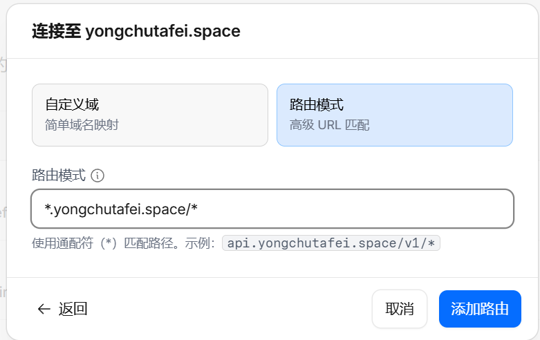
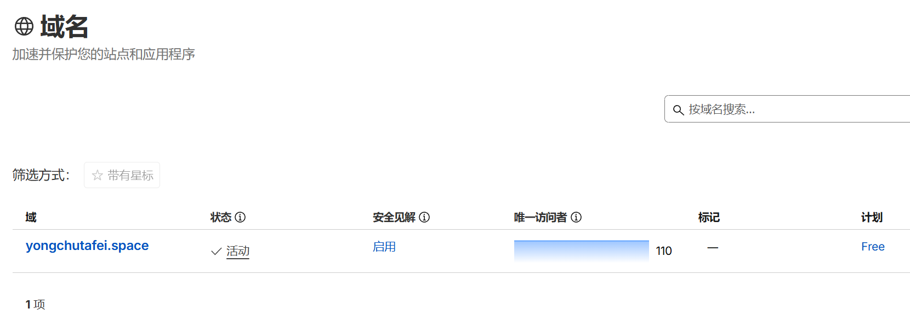
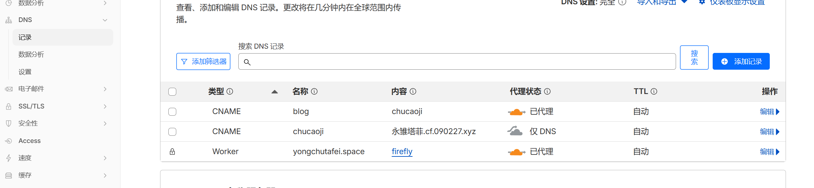
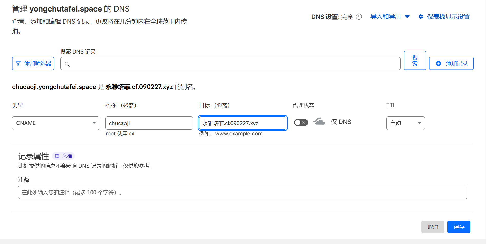
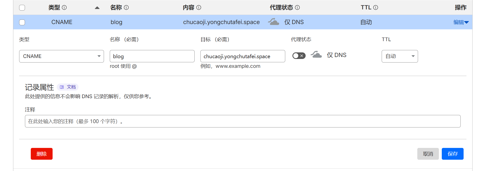
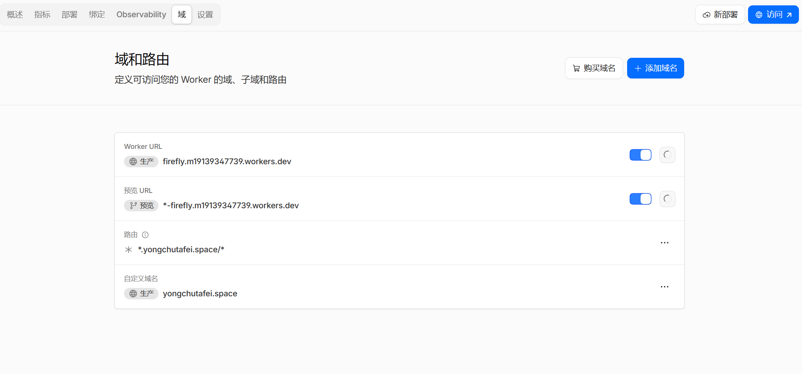

## 🌟 什么是 IP 优选？

在搭建个人博客的过程中，很多朋友会遇到一个常见的问题：**国内访问速度慢、延迟高**。这往往是因为默认的 CDN 节点分配不够理想造成的。

> **IP 优选**的核心思路是：**让你的博客自动选择距离访客最近且响应最快的 Cloudflare 节点**，从而大幅降低网络延迟，提升访问体验。

## 🛠️ 前置准备

在开始配置之前，你需要准备以下内容：

- 一个 **Cloudflare 账号**
- 一个已托管到 Cloudflare 的域名
- 你的博客站点（本站使用的是基于 Astro 框架的 [Firefly](https://github.com/CuteLeaf/Firefly) 主题模板）

:::tip 小提示
本文以 `yongchutafei.space` 作为示例域名，通过 Cloudflare 的路由规则和 DNS 配置实现 IP 优选功能。
:::

## 🚀 配置步骤

### 第一步：添加路由规则

首先，登录 [Cloudflare Dashboard](https://dash.cloudflare.com/)，进入你的域名管理面板。我们需要先添加一条路由规则来引导流量：

1. 在左侧菜单中选择 **「Workers 和 Pages」** → 进入 **域和路由** 页面
2. 点击 **「添加域名」** 或 **「添加自定义域」**
3. 选择 **「路由模式」**，输入匹配路径（如 `*.yongchutafei.space/*`）
4. 点击 **「添加路由」** 完成创建

### 第二步：进入域名管理

从 **「域名」** 标签页进入，选择你需要配置的域名（本例为 `yongchutafei.space`）：

### 第三步：配置 DNS 记录

切换到 **DNS** 设置页面，我们需要添加两条关键记录来实现 IP 优选：

#### 记录一：代理网站记录（chucaoji）

这是用于 IP 优选的中转站点，实际上它就是我们的优选接口地址：

| 字段 | 值 | 说明 |
|------|-----|------|
| 类型 | CNAME | 别名记录 |
| 名称 | chucaoji | 子域名 |
| 目标 | 永雏塔菲.cf.090227.xyz | 代理目标地址 |
| 代理状态 | 仅 DNS（灰色云朵）| 此处关闭代理 |

> 注意：chucaoji 这条记录的代理状态设为 **仅 DNS**，因为它本身就是一个 IP 优选服务端点。

#### 记录二：博客站点记录

博客域名通过 chucaoji 代理来实现 IP 优选：

| 字段 | 值 | 说明 |
|------|-----|------|
| 类型 | CNAME | 别名记录 |
| 名称 | blog | 博客子域名 |
| 目标 | chucaoji.yongchutafei.space | 指向代理地址 |
| 代理状态 | 仅 DNS（灰色云朵）| 通过代理转发 |

> **核心原理**：`chucaoji` 网站本身就是一个 IP 优选服务端点，而 `blog` 网站通过指向 `chucaoji` 进行代理转发，从而实现自动选取最优节点的效果。

### 第四步：确认 Worker 路由配置

完成以上步骤后，可以在 **Workers 和 Pages** → **域和路由** 中查看完整的路由配置状态：

## 📊 效果验证

完成以上配置后，如何确认 IP 优选是否生效呢？推荐使用以下工具进行测试：

### 推荐工具：itdog.cn

[itdog.cn](https://www.itdog.cn/) 是一个非常实用的在线测速平台，支持全国多地区 Ping 测试、路由追踪等功能。

1. 打开 [itdog.cn](https://www.itdog.cn/)
2. 输入你的博客域名
3. 选择 **Ping 检测** 或 **多地点测速**
4. 观察各地区的延迟数据

### 预期效果

配置成功后，你应该能看到类似以下的改善效果：

- **国内各地区延迟明显下降**
- **解析到的 IP 地址为优化后的优质节点**
- **整体访问速度提升，加载更快**

## ✅ 总结

通过 Cloudflare IP 优选方案，我们可以用较低的成本实现博客访问速度的显著提升。整个过程主要分为四步：

1. **添加路由规则** — 定义流量转发策略和匹配路径
2. **进入域名管理** — 选择目标域名
3. **配置 DNS 记录** — 设置 chucaoji 代理站点和 blog 博客站点
4. **验证路由配置** — 确认 Worker 域和路由生效

如果你在配置过程中遇到问题，欢迎留言交流讨论！
